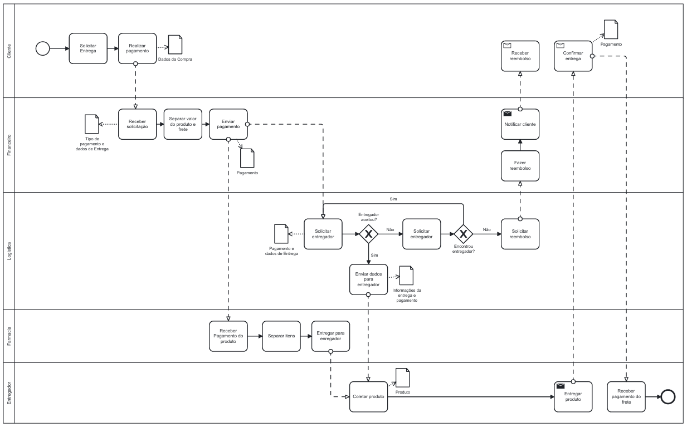

### 3.3.1 Processo 1 – Entrega dos Produtos

#### Diagrama AS IS 
Nesse diagrama é o processo atual de entrega de produtos.

#### Detalhamento das atividades

**titulo**

| **Campo**       | **Tipo**         | **Restrições** | **Valor default** |
| ---             | ---              | ---            | ---               |
| | |    |     |

| **Comandos**         |  **Destino**                   | **Tipo** |
| ---                  | ---                            | ---               |
| |   |  |

---

#### Diagrama TO BE
Nesse diagrama foi passado a nossa proposta de compra online e entrega sustentável.

#### Detalhamento das atividades

**Solicitar Entrega**

| **Campo**       | **Tipo**         | **Restrições** | **Valor default** |
| ---             | ---              | ---            | ---               |
| nome_cliente| Caixa de Texto|   obrigatório    |                   |
| endereço_entrega|    	Área de Texto              |   obrigatório             |                   |
| telefone_contato| Caixa de Texto   | formato: (99) 99999-9999 |                |
| observações | Área de Texto  | opcional |           |
| comprovante_identidade| Arquivo  | formatos permitidos: .pdf, .jpg, .png	 |           |

| **Comandos**         |  **Destino**                   | **Tipo** |
| ---                  | ---                            | ---               |
| continuar | Realizar pagamento  | default |
| cancelar      |          Fim do processo                      |         cancel          |

---

**Realizar pagamento**

| **Campo**       | **Tipo**         | **Restrições** | **Valor default** |
| ---             | ---              | ---            | ---               |
| método_pagamento | Seleção única |  opções: cartão de crédito, débito, boleto    | cartão de crédito    |
| valor_total     | Número |  obrigatório, maior que zero  |                   |
| dados_cartão   |  Caixa de Texto   |   obrigatório se método for cartão    |                   |
| validade_cartão  |  Data  |   obrigatório se método for cartão  |                   |
| código_segurança    |   Número   |   obrigatório se método for cartão, 3 dígitos    |                   |

| **Comandos**         |  **Destino**                   | **Tipo**          |
| ---                  | ---                            | ---               |
| continuar | 	Enviar pagamento | default |
| cancelar      |          Fim do processo                      |         cancel          |

---

**Receber solicitação**

| **Campo**       | **Tipo**         | **Restrições** | **Valor default** |
| ---             | ---              | ---            | ---               |
| tipo_pagamento|Seleção única|   Opções: cartão de crédito, débito, boleto    | Cartão de crédito                  |
| dados_entrega|    	Área de Texto              |   obrigatório             | -                  |

| **Comandos**         |  **Destino**                   | **Tipo**          |
| ---                  | ---                            | ---               |
| Continuar | 	Separar valor do produto e frete | default |
| Cancelar      |          Fim do processo                      |         cancel          |

---

**Separar valor do produto e frete**

| **Campo**       | **Tipo**         | **Restrições** | **Valor default** |
| ---             | ---              | ---            | ---               |
| valor_produto|Número|   Obrigatório, maior que zero    | -                  |
| valor_frete| Número              |   Obrigatório, maior que zero   | -                  |

| **Comandos**         |  **Destino**                   | **Tipo**          |
| ---                  | ---                            | ---               |
| Continuar | Enviar pagamento	| default |
| Cancelar | Fim do processo	| cancel |

---

**Enviar pagamento**

| **Campo**       | **Tipo**         | **Restrições** | **Valor default** |
| ---             | ---              | ---            | ---               |
| id_pagamento | Número | 	gerado automaticamente | 	autogerado |
| valor_total | Número | obrigatório, maior que zero |  |
| status_pagamento | Seleção única |opções: aprovado, pendente, recusado  |  pendente|
| data_pagamento | Data e Hora | obrigatório se aprovado |  |
| comprovante | Arquivo | formatos permitidos: .pdf, .jpg, .png |  |

| **Comandos**         |  **Destino**                   | **Tipo**          |
| ---                  | ---                            | ---               |
| Confirmar| 	Solicitar entregador| default |
| Cancelar | Fim do processo	| cancel |

---

**Solicitar entregador**

| **Campo**       | **Tipo**         | **Restrições** | **Valor default** |
| ---             | ---              | ---            | ---               |
|id_entregador  |Número  | gerado automaticamente | autogerado |
| dados_entrega | Área de Texto | obrigatório |  |
| pagamento_frete | Número | obrigatório, maior que zero |  |
| status_entregador | Seleção única | opções: aceitou, recusou | pendente |

| **Comandos**         |  **Destino**                   | **Tipo**          |
| ---                  | ---                            | ---               |
|aceitar	|Enviar dados para entregador|	default|
|recusar	|Solicitar entregador novamente|	cancel|

---

**Enviar dados para entregador**

| **Campo**       | **Tipo**         | **Restrições** | **Valor default** |
| ---             | ---              | ---            | ---               |
|id_entrega	|Número|	gerado automaticamente|	autogerado|
|nome_entregador|	Caixa de Texto|	obrigatório	||
|dados_entrega|	Área de Texto	|obrigatório	||
|status_entrega|	Seleção única	|opções: em andamento, finalizada	|em andamento|

| **Comandos**         |  **Destino**                   | **Tipo**          |
| ---                  | ---                            | ---               |
|confirmar|	Coletar produto|	default|
|cancelar|	Fim do processo|	cancel|

---

**Coletar produto**

| **Campo**       | **Tipo**         | **Restrições** | **Valor default** |
| ---             | ---              | ---            | ---               |
|id_produto|	Número	|gerado automaticamente	|autogerado|
|descrição_produto|	Área de Texto	|obrigatório	||
|quantidade|	Número	|obrigatório, maior que zero	||
|status_coleta|	Seleção única	|opções: coletado, pendente	|pendente|

| **Comandos**         |  **Destino**                   | **Tipo**          |
| ---                  | ---                            | ---               |
|confirmar|	Entregar produto|	default|
|cancelar|	Fim do processo|cancel|

---

**Entregar produto**

| **Campo**       | **Tipo**         | **Restrições** | **Valor default** |
| ---             | ---              | ---            | ---               |
|id_entrega	|Número|	gerado automaticamente|autogerado|
|nome_cliente|	Caixa de Texto|	obrigatório	||
|status_entrega|	Seleção única	|opções: entregue, não entregue	|pendente|
|data_entrega|	Data e Hora	|obrigatório se entregue	||
|comprovante_entrega	|Arquivo|	formatos permitidos: .pdf, .jpg, .png||

| **Comandos**         |  **Destino**                   | **Tipo**          |
| ---                  | ---                            | ---               |
|confirmar|	Confirmar entrega|	default|
|cancelar|	Fim do processo|	cancel|

---

**Confirmar entrega**

| **Campo**       | **Tipo**         | **Restrições** | **Valor default** |
| ---             | ---              | ---            | ---               |
| status_entrega | Seleção única | Opções: entregue, não entregue | - |

| **Comandos**         |  **Destino**                   | **Tipo**          |
| ---                  | ---                            | ---               |
| entregue | Receber pagamento do frete	| default |
| não entregue | Fazer reembolso	| cancel |

---

**Receber pagamento do frete**

| **Campo**       | **Tipo**         | **Restrições** | **Valor default** |
| ---             | ---              | ---            | ---               |
| pagamento_frete | Número | Obrigatório, maior que zero | - |

---

| **Comandos**         |  **Destino**                   | **Tipo**          |
| ---                  | ---                            | ---               |
| fim do processo | Finalizar	| default |

